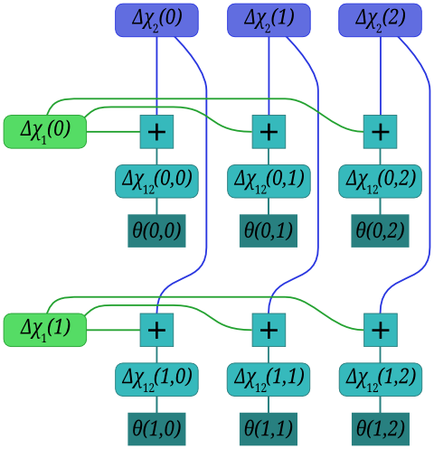
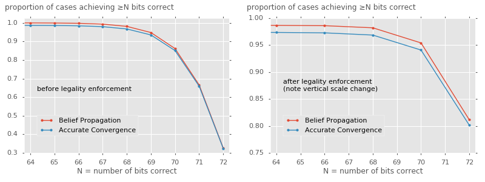

% Lorenz cipher 'Rectangling' and Belief Propagation

<a href="http://www.redfrontdoor.org/blog/">Ben North</a>, September 2016

## Motivation and background

This write-up assumes some level of background knowledge of the Lorenz
cipher machine and the attacks automated by Colossus.  The
[Wikipedia article](https://en.wikipedia.org/wiki/Cryptanalysis_of_the_Lorenz_cipher)
gives a good description, as does the source material provided by the
[*General Report on Tunny*](http://www.ellsbury.com/tunny/tunny-000.htm)
(henceforth *GRT*).

The motivation for this study came in two parts:

*   ### Question posed by Tutte

    The book
    *[Colossus: The secrets of Bletchley Park's code-breaking computers](https://global.oup.com/academic/product/colossus-9780199578146?cc=us&lang=en&)*
    has an appendix written by William T. Tutte, '*My Work at Bletchley
    Park*'.  [Tutte](https://en.wikipedia.org/wiki/W._T._Tutte) was the
    Bletchley Park codebreaker who, in what has been called 'one of the
    greatest intellectual feats of World War II', reverse-engineered the
    structure of the Lorenz cipher machine just from a sample of key.
    In this appendix, he writes (p.368, **emphasis** added):

    <blockquote>
    Having got a key *K*, we can write

    

    *&Delta;*(*K*1 + *K*2)
    = *&Delta;*(*&chi;*1 + *&chi;*2) + *&Delta;*(*&psi;*1 + *&psi;*2).
    

    But *&Delta;*(*&psi;*1 + *&psi;*2) is about 70 per
    cent dot.  *\['Dot' is the term used for a binary zero.\]* Hence
    *&Delta;*(*K*1 + *K*2) must be in 70 per cent
    agreement with *&Delta;*(*&chi;*1 + *&chi;*2).
    And the agreement would still be 70 percent for other pairs of impulses.
    **Surely with 1000 or so letters of key the rectangle method would have
    resolved *&Delta;*(*K*1 + *K*2) into
    *&Delta;&chi;*1 and *&Delta;&chi;*2?** I suppose I
    could check this if I went to enough trouble.  But what would be the
    point now, so long after the last Fish message was sent?  On second
    thoughts the problem could be reformulated as one in pure mathematics
    and so made worth solving.  It would not be the first of Bletchley's
    little problems to undergo such a transformation.
    </blockquote>

    I thought the **emphasised** question was an interesting one.

*   ### Similarity to Belief Propagation for Low-Density Parity Check codes

    *GRT* explains the procedures and formulae used in recovering the
    *&chi;* wheels from ciphertext, and they struck me as very similar
    to the Belief Propagation algorithm used for decoding LDPC codes.  I
    thought it would be interesting to more properly compare the two
    methods, and also to ask whether Belief Propagation, first proposed
    in 1982, was an improvement over the methods used at Bletchley Park.

This study combines these points, and looks at chi-breaking from key
under both the 'accurate convergence' described in *GRT* and the 'belief
propagation' approach.  Can we recover *&Delta;&chi;*1 and
*&Delta;&chi;*2 from 1000 or so letters of *K*?

## Channel capacity, information per letter

We can get a sanity-check sense for whether '1000 or so letters of key'
will be sufficient to break &chi;1 and &chi;2 by
looking at the information carried in one received bit of
*K*12.  We have to recover at most 72 bits (&chi;1
is of length 41; &chi;2 is of length 31; 'at most' because
there are constraints on the patterns, described more fully below).

The received bit depends on the value of *B*, the 'dot'-biased noise
term *&Delta;*(*&psi;*1 + *&psi;*2), as follows:

+ If *B*&nbsp;=&nbsp;0, we receive the true value of *&Delta;&chi;*12(*i*,&#8239;*j*) &mdash;
  this happens 70% of the time; or
+ if *B*&nbsp;=&nbsp;1, we receive the complement of *&Delta;&chi;*12(*i*,&#8239;*j*) &mdash;
  this happens 30% of the time.

This is a
'[binary symmetric channel](https://en.wikipedia.org/wiki/Binary_symmetric_channel)',
with capacity 1&nbsp;&#8722;&nbsp;*H**b*(*p*), where
*H**b* is the
[binary entropy function](https://en.wikipedia.org/wiki/Binary_entropy_function)
and *p* is the crossover probability, here 30%.  In our case, then, the
capacity is
1&nbsp;&#8722;&nbsp;*H**b*(0&middot;3)&nbsp;=&nbsp;0&middot;119.
Receiving 1000 such values ought to provide 119 bits of information, then,
which exceeds the 72 we require.  So on the face of it, we do have enough
information; but whether our decoding algorithm is good enough to
extract it is another question.

## Chi-breaking by 'Rectangling'

The process of 'Rectangling' used at Bletchley Park for recovering the
wheel patterns is described in detail in
[Chapter 24 of GRT](http://www.ellsbury.com/tunny/tunny-113.htm), but
to summarise:

The unknown *&chi;*1 wheel can be represented as a
binary-valued vector of length 41 (indexed from 0 up to 40); similarly,
the *&chi;*2 wheel by a 31-long vector.  We can generate a
'*&chi;* stream', a time series of length-2 vectors whose first
component is consecutive entries from *&chi;*1 and second
*&chi;*2 by rotating these wheels (together) one bit-position
at a time.  We are interested in the streams *&Delta;&chi;*1
and *&Delta;&chi;*2, where
*&Delta;&chi;**k*(*t*)&nbsp;=&nbsp;&chi;*k*(*t*)&nbsp;+&nbsp;&chi;*k*(*t*&nbsp;&#8722;&#8239;1).
(The 'delta' implies difference but in the xor-based arithmetic used,
addition is the same as subtraction.)  We are also interested in their
sum, denoted
*&Delta;&chi;*12&nbsp;=&nbsp;*&Delta;&chi;*1&nbsp;+&nbsp;*&Delta;&chi;*2,
which is cyclic of length 41&#8239;&times;&#8239;31&nbsp;=&nbsp;1271.

The model is that there is also a 'biased coin' *B* which produces 0
more often than it produces 1.  We flip this coin independently for each
*t*, and then observe a sequence of
*&Delta;&chi;*1(*t*)&nbsp;+&nbsp;*&Delta;&chi;*2(*t*)&nbsp;+&nbsp;*B*(*t*).

The challenge is to recover *&Delta;&chi;*1 and
*&Delta;&chi;*2.  This is only possible up to the
transformation which inverts all bits of both *&Delta;&chi;*1
and *&Delta;&chi;*2, because such a transformation would
leave the observed *&Delta;&chi;*12 unchanged.  We do also
have some constraints on the *&Delta;&chi;* vectors; an immediate one is
that such a vector must have an even number of 1s (otherwise it could
not be 'integrated' to find *&chi;*), and see the discussion of 'legal
wheels' below.

### What is the 'biased coin'?

The 'biased coin' *B* can be:

If we are working with intercepted ciphertext, *B* is *&Delta;D*12,
the sum of the first and second impulses of delta-de-*&chi;* (i.e.,
delta-*&psi;* + delta-plain).

If, as pondered in the Tutte quote motivating this study, we are working with
a section of key *K* recovered from a depth, *B* is *&Delta;&psi;*12.
Hence the equation in the quote:

*&Delta;*(*K*1 + *K*2)
= *&Delta;*(*&chi;*1 + *&chi;*2)
+ *&Delta;*(*&psi;*1 + *&psi;*2).

## Reduction of observations to rectangle of counts

In full, the information we have is a list of the observed
*&Delta;&chi;*1(*t*&nbsp;%&nbsp;41) +
*&Delta;&chi;*2(*t*&nbsp;%&nbsp;31) + *B*(*t*) values for
0&#8239;&le;&#8239;*t*&nbsp;&lt;&#8239;*T*, where *T* is the number of letters received.

Since all *B*(*t*) are independent, and because of the cyclic nature of
the *&Delta;&chi;* streams, we can reduce the information to just a
difference of 'number of 0s &#8722; number of 1s' corresponding to each
*&Delta;&chi;*1(*i*) and *&Delta;&chi;*2(*j*).  If
we receive fewer than 1271 letters, we'll receive no information for some
(*i*,&#8239;*j*) pairs.

The information we have is therefore a 'rectangle' of signed counts,
called *&theta;*(*i*,&#8239;*j*).

## Iterative 'convergence'

The following process for estimating the *&Delta;&chi;*2 and
*&Delta;&chi;*1 vectors from the *&theta;*(*i*,&#8239;*j*)
rectangle is described in
[Section 24C of GRT](http://www.ellsbury.com/tunny/tunny-120.htm), and
was known as 'crude convergence'.

The idea was, approximately speaking:  Hypothesise some vector of 41
values for *&Delta;&chi;*1 (a 'start').  Then, for each
*j&#8239;&lt;&#8239;31*, look at all the *&theta;*(*i*,&#8239;*j*) for
*i*&#8239;&lt;&#8239;41.  Because *B* gives 0 more often than it gives
1, a positive *&theta;*(*i*,&#8239;*j*) is evidence that
*&Delta;&chi;*12(*i*,&#8239;*j*)&nbsp;=&nbsp;0, i.e., that
*&Delta;&chi;*2(*j*)&nbsp;=&nbsp;*&Delta;&chi;*1(*i*).
A negative *&theta;*(*i*,&#8239;*j*) is evidence that
*&Delta;&chi;*2(*j*)&nbsp;&ne;&nbsp;*&Delta;&chi;*1(*i*).

Pretending for a minute that we know all *&Delta;&chi;*1 values to be
correct, then, this means:

+ *&theta;*(*i*,&#8239;*j*)&nbsp;&gt;&nbsp;0 and *&Delta;&chi;*1(*i*)&nbsp;=&nbsp;0 is evidence for *&Delta;&chi;*2(*j*)&nbsp;=&nbsp;0;
+ *&theta;*(*i*,&#8239;*j*)&nbsp;&gt;&nbsp;0 and *&Delta;&chi;*1(*i*)&nbsp;=&nbsp;1 is evidence for *&Delta;&chi;*2(*j*)&nbsp;=&nbsp;1;
+ *&theta;*(*i*,&#8239;*j*)&nbsp;&lt;&nbsp;0 and *&Delta;&chi;*1(*i*)&nbsp;=&nbsp;0 is evidence for *&Delta;&chi;*2(*j*)&nbsp;=&nbsp;1;
+ *&theta;*(*i*,&#8239;*j*)&nbsp;&lt;&nbsp;0 and *&Delta;&chi;*1(*i*)&nbsp;=&nbsp;1 is evidence for *&Delta;&chi;*2(*j*)&nbsp;=&nbsp;0.

Let *&epsilon;*1 be the vector which has the value +1
whenever *&Delta;&chi;*1&nbsp;=&nbsp;0 and the value &#8722;1
whenever *&Delta;&chi;*1&nbsp;=&nbsp;1.  Then
&Sigma;&#8239;*i*&#8239;\[*&epsilon;*1(*i*)*&theta;*(*i*,&#8239;*j*)\]
is, in some sense, the total evidence that
*&Delta;&chi;*2(*j*)&nbsp;=&nbsp;0.  If this sum is negative,
we should suspect that *&Delta;&chi;*2(*j*)&nbsp;=&nbsp;1.

In this way, we determine, on the preponderence of evidence, the most
likely value of each *&Delta;&chi;*2(*j*).

Then, fix that 31-long vector *&Delta;&chi;*2 and run the
same process in the other direction to estimate
*&Delta;&chi;*1.  Repeat.  The idea is that this process will
converge to a good estimate of the two *&Delta;&chi;* vectors.

### Accurate convergence

The process of 'accurate convergence' handles the calculation in a more
formal probabilistic setting, and derives a more accurate procedure.  It
tracks a continuous score for how likely each bit is to be zero or one,
as opposed to just which value is more likely.  The details are given in
[Section 24W(a) of GRT](http://www.ellsbury.com/tunny/tunny-130.htm),
but in summary:

First define *&zeta;* as the ratio
*P*(*B*&#8239;=&#8239;0)&#8239;/&#8239;*P*(*B*&#8239;=&#8239;1), i.e.,
the factor by which it is more likely that *B* will yield 0 rather than 1.
For our case, where '*&Delta;*(*&psi;*1 +
*&psi;*2) is about 70 per cent dot', we have
*&zeta;*&nbsp;&#8776;&nbsp;2&middot;33.

Then define the 'score' *x**i* as the
log-base-*&zeta;*-likelihood-ratio of the hypothesis
'*&Delta;&chi;*1(*i*)&nbsp;=&nbsp;0' (as compared to the
alternative '*&Delta;&chi;*1(*i*)&nbsp;=&nbsp;1').
Similarly, *y**j* is the score of the hypothesis
*&Delta;&chi;*2(*j*)&nbsp;=&nbsp;0.  By alternating between

+ treating the *x**i* as 'true' and updating the *y**j* accordingly; and
+ treating the *y**j* as 'true' and updating the *x**i* accordingly,

we obtain the following update rules:

$$y_j = \sum_i f(\theta_{ij}, x_i);\quad x_i = \sum_j f(\theta_{ij}, y_j)$$
where
$$f(k, l) = \log_\zeta \left(\frac{\zeta^{k+l} + 1}{\zeta^k + \zeta^l}\right).$$

The process of 'accurate convergence' performs these updates in turn
until convergence of the signs of the scores, at which point the two
*&Delta;&chi;* vectors have been estimated.

## Similarity to Belief Propagation methods for LDPC codes

It occurred to me that the rectangling problem is very similar to the
decoding problem for
[Low-Density Parity Check](https://en.wikipedia.org/wiki/Low-density_parity-check_code)
error-correcting systems, in the following sense.

When rectangling, we have a large collection of bits for which:

+ there are parity relations between small subsets of them;
+ we receive noisy information on the values of the bits,

and this is exactly the set-up for a LDPC code.

Expressing rectangling in LDPC terms, the transmitted bits are the
individual *&Delta;&chi;*1(*i*) and
*&Delta;&chi;*2(*j*), and also their (xor) sums
*&Delta;&chi;*12(*i*,&#8239;*j*).  We receive no direct
information on any *&Delta;&chi;*1(*i*) or
*&Delta;&chi;*2(*j*) but do have some noisy information on
each *&Delta;&chi;*12(*i*,&#8239;*j*) &mdash; the
*&theta;*(*i*,&#8239;*j*) counts of excess zeros over ones.  We can
think of this as a situation where, in LDPC terms, we receive no data
bits, and only have noisy information on the parity bits.

### Decoding LDPC codes via Belief Propagation

One popular decoding method for LDPC codes is Belief Propagation, one of
a set of 'Factor Graph' algorithms.  This paper gives a clear
explanation of this class of algorithms:

+ '*KFL*' &mdash; [Kschischang, Frey, and Loeliger: 'Factor Graphs and the Sum-Product Algorithm'](http://vision.unipv.it/IA2/Factor%20graphs%20and%20the%20sum-product%20algorithm.pdf)

In a Factor Graph setting, we view the LDPC decoding problem on a graph
whose nodes are of three types: variables, checks, or observations.  The
graph's edges show which variables are related by parity checks, and
which variable appears in which observation.

In our case, the parity checks arise from the definition of *&Delta;&chi;*12:

*&Delta;&chi;*12(*i*,&#8239;*j*)&nbsp;=&nbsp;*&Delta;&chi;*1(*i*)&nbsp;+&nbsp;*&Delta;&chi;*2(*j*).

Equivalently,

*&Delta;&chi;*1(*i*)&nbsp;+&nbsp;*&Delta;&chi;*2(*j*)&nbsp;+&nbsp;*&Delta;&chi;*12(*i*,&#8239;*j*)&nbsp;=&nbsp;0.

Our variables, then, are the 41 *&Delta;&chi;*1 values, the
31 *&Delta;&chi;*2 values, and the 1271
*&Delta;&chi;*12 values.  As a factor graph, we also have
'dongle' nodes for the observations *&theta;*(*i*,&#8239;*j*) concerning
*&Delta;&chi;*12(*i*,&#8239;*j*), and check nodes for the
relationship between *&Delta;&chi;*1(*i*),
*&Delta;&chi;*2(*j*), and
*&Delta;&chi;*12(*i*,&#8239;*j*).  For a simplified
2&#8239;&times;&#8239;3 case, the graph is:

Each square '+' node indicates that the variables connected to it must
sum to zero.

The 'message passing' algorithm (see the *KFL* paper for details) gives
update rules in terms of numerical messages passed between nodes.  In our case, we
use the log-base-$\zeta$-likelihood-ratio representation, and define
*x**i* to be the value of the *&Delta;&chi;*1(*i*)
node, which is the sum of that node's incoming messages.  Similarly,
*y**j* is the value of the *&Delta;&chi;*2(*j*)
node.  These scores mean exactly the same as the *x**i* and
*y**j* scores of the Accurate Convergence scheme.

The computation performed by a variable node for the LLR representation
is just to sum the incoming message values (p.512 of *KFL*).

The computation performed by each of our degree-three check nodes is via
the function $$CHK(\lambda_1, \lambda_2) = \frac{1 +
\lambda_1\lambda_2}{\lambda_1 + \lambda_2}.$$ where $\lambda$ are the
likelihood ratio values (NB *not* the log-likelihood ratios).  In terms
of log-likelihood-ratio values *k* and *l*, then:  $$CHK(k, l)
  = \log_\zeta\left(\frac{1 + \zeta^k\zeta^l}{\zeta^k + \zeta^l}\right).$$
which is identical to the Bletchley Park $f()$ function for accurate
convergence; we will therefore rename it $f$.  This $f$ function is only
ever called with some *&theta;*(*i*,&#8239;*j*) as one of its arguments; no messages
get sent towards the 'dongle' node containing the observation
*&theta;*(*i*,&#8239;*j*).

We keep track of *x**i*(*j*), the most recent message emitted by the
variable node for *&Delta;&chi;*1(*i*) along the edge to the check node
that variable shares with *&Delta;&chi;*2(*j*).  The message value
*y**j*(*i*) is defined similarly.  The messages
into and out of a check node are:

The score *x**i* is the log-*&zeta;*-likelihood-ratio of
'*&Delta;&chi;*1(*i*)&nbsp;=&nbsp;0', and it is updated via
the 31 incoming messages, to

$$x_i = \sum_{j=0}^{30} f(\theta_{ij}, y^{(i)}_j).$$

Note that this is almost the same as the Accurate Convergence update
rule, except there the summand is
*f*(*&theta;*ij,&#8239;*y**j*) rather than the
*f*(*&theta;*ij,&#8239;*y**j*(*i*)) we
have here.

The message *y**j*(*i*), in turn, is the sum of all messages which
*&Delta;&chi;*2(*j*) receives over all other edges, i.e., all edges besides
the one connecting it to *&Delta;&chi;*12(*i*,&#8239;*j*).  Equivalently,
*y**j*(*i*) is the sum of all incoming messages (which is the score,
*y**j*) reduced by the message it received along the edge connecting it to
*&Delta;&chi;*12(*i*,&#8239;*j*):

$$y^{(i)}_j = y_j - f(\theta_{ij}, x^{(j)}_i).$$

For a 'large' number of incoming edges, we might hope that the
difference between *y**j* and
*y**j*(*i*) would be small, in which case Belief
Propagation and Accurate Convergence should behave very similarly.

## Importance of 'legality' constraint

The actual operational *&chi;* patterns were significantly constrained.
The rules for a valid ('legal') *&chi;* pattern are described in
[Section 22B of GRT](http://www.ellsbury.com/tunny/tunny-046.htm):

+ *&chi;* must have, as nearly as possible, an equal number of 0s and 1s;
+ *&Delta;&chi;* must be a valid differenced wheel in that it must have
  an even number of 1s;
+ *&Delta;&chi;* must have, as nearly as possible, an equal number of 0s and 1s;
+ *&chi;* must not have more than four consecutive equal values
  (equivalently, *&Delta;&chi;* must not have more than three consecutive&nbsp;0s).

It seems that these extra constraints were important when *&chi;*-breaking;
[Section 25D(e) of GRT](http://www.ellsbury.com/tunny/tunny-165.htm)
talks about adjusting candidate wheels to make them legal.  Not many
details are given, but we can imagine that an approach a little like the
following might have been used.  No doubt the methods used by the
experienced codebreakers were more sophisticated.

### Finding 'nearby' legal wheel

Recall that we can only recover the delta-wheels up to the
transformation which inverts all bits of both of them &mdash; that
transformation preserves *&Delta;&chi;*12, which is all we
(noisily) observe.  In view of this, we adopt the following steps for
finding a pair of legal wheels 'close' to the converged estimate:

If the converged state (or its inverse) consists of two legal
*&Delta;&chi;* wheels, accept it.

Otherwise, use the magnitude of the *x**i* scores (for
*&Delta;&chi;*1) and the *y**j* scores (for
*&Delta;&chi;*2) to rank each wheel's bits in order from
least certain to most certain, and take the least certain twelve for
each wheel.  Try flipping each single bit in turn; if that gives a legal
*&Delta;&chi;* wheel (or the inversion of one), add it to list of
candidates for that wheel, noting the 'cost' (how much evidence was
overruled), and whether the wheel needed to be inverted.  Then try
flipping two bits at a time, then three.  Rank all candidates for each
wheel from least costly to most.

Combine a candidate *&Delta;&chi;*1 with a candidate
*&Delta;&chi;*2 such that either neither wheel is inverted or
both are inverted.  Accept the least costly candidate pair of wheels.

### Generating legal wheels

For the experiments described shortly, we need to be able to randomly
generate legal wheels and evaluate the algorithms' performance on them.
[Section 25X of GRT](http://www.ellsbury.com/tunny/tunny-192.htm) notes
that legal wheels may be enumerated by a process which, for the 41-long
*&chi;*1 wheel, boils down to choosing ten integers, each
between 1 and 4 inclusive, with sum 20; and another ten such with
sum 21.  These are the lengths of blocks of 0s and 1s.

The problem of randomly generating sets of ten such numbers, uniformly
over all possibilities, turned out to be an interesting sub-project in
the course of this study.  I solved it by adapting the algorithm
described in the paper
[Polynomial Time Perfect Sampler for Discretized Dirichlet Distribution](http://tcslab.csce.kyushu-u.ac.jp/~kijima/papers/METR2003-17.pdf)
(Matsui and Kijima) to incorporate an upper bound on the values each
summand may take.  I have not formally proved that the modified
algorithm obeys all requirements to generate uniform samples, but I
think it does, and the behaviour seems reasonable.  For present
purposes, then, it is certainly acceptable.

## Simulations

To explore these ideas, we can simulate the process of attemping to
recover the two *&Delta;&chi;* patterns as follows:

* Generate a random legal *&chi;1* wheel and a random
  legal *&chi;2* wheel.
* From these, find the two *&Delta;&chi;* wheels.
* Generate 1000 independent samples of *B* (i.e.,
  *&Delta;&psi;*12), with
  *P*(*B*&#8239;=&#8239;0) of 70%
* Combine to create a sequence of 1000 values of *K12* via
  *K12* = *&Delta;&chi;*12 + *B*.
* Form into rectangle *&theta;*(*i*,&#8239;*j*) by counting excess 0s
  over 1s for each (*i*,&#8239;*j*).
* For each algorithm (Accurate Convergence and Belief Propagation):
    * Using a random starting estimate for the wheels' scores, apply the
      algorithm to find a 'raw' estimate of the two
      *&Delta;&chi;* wheels.
    * Count the number of correct bits in the estimates vs the ground
      truth patterns.  Because of the inversion ambiguity, take the 'number
      correct' evaluation as the greater of the actual number of correct
      bits, and 72&nbsp;&#8722;&nbsp;(raw number correct).
    * Apply the 'find nearby legal wheel pair' process.
    * Count the number of correct bits in these new patterns.  This time
      we will not have an inverted wheel (because we must have arrived at
      *&Delta;&chi;* patterns with an even number of 1s), and so there is
      no 'also consider 72&nbsp;&#8722;&nbsp;(raw number correct)' step.

This simulation was performed 1,000,000 times, and the proportion of
cases achieving at least *N* correct bits, for various *N*, was found.
We are hoping for a high proportion of cases achieving a high number of
correct bits.

### Results

The performance of the two algorithms, before and after legality
enforcement, was as follows.

### Observations

Left graph: Even before error correction using the legality constraint,
both methods do well.  They perfectly recover the wheel patterns around
a third of the time, and 'almost' succeed (getting at most two bits
wrong) a further half of the time.  The Belief Propagation algorithm
does very slightly better, although not meaningfully.

Right graph: After adjusting the recovered patterns so as to find a
legal pair of wheel patterns, the 'perfect recovery' rate jumps to
around 80% for each algorithm.  The 'almost success' rate, allowing up
to two wrong bits, jumps to around 95%.  Note that we only ever get an
even number of bits right, as an odd number of incorrect bits would mean
one proposed delta-wheel would have an odd number of 1s, an
impossibility.

These experiments have studied the most difficult pair of wheels, i.e.,
the longest ones.  Breaking the shorter *&chi;* wheels would presumably
be easier, with the algorithms achieving a higher success rate.

Although Belief Propagation does appear to perform slightly better than
Accurate Convergence, I do not think it would have been useful to the
codebreakers at Bletchley Park.  The much greater amount of state
required to run the algorithm (41&#8239;&times;&#8239;31 messages values
rather than 41&#8239;+&#8239;31 scores) would make it impracticable to
perform manually.

## Conclusions

The detailed behaviour of the algorithms could be characterised more
fully, but we have learnt enough to answer Tutte's question

> Surely with 1000 or so letters of key the rectangle method would have
resolved *&Delta;*(*K*1 + *K*2) into
*&Delta;&chi;*1 and *&Delta;&chi;*2?

with 'very likely, yes'.

## Source code

Available on github: [bennorth/rectangling-ldpc](https://github.com/bennorth/rectangling-ldpc).

<a href="http://www.redfrontdoor.org/blog/">Ben North</a>, September 2016

This web-page content Copyright 2016 Ben North; licensed under <a href="http://creativecommons.org/licenses/by-sa/4.0/">CC BY-SA 4.0</a>

